# Applications of the Laplacian Matrix of Graphs

Goal: Investigate how the spectrum of a graph Laplacian relates to network robustness under
random failures and targeted attacks.

## Run a single experiment

`experiments/run_single.py` runs one graph generator + one attack strategy and writes a CSV
with robustness and spectral metrics.

Example: Erdos-Renyi graph under random failures (defaults shown):
```bash
python experiments/run_single.py \
  --graph erdos_renyi \
  --attack random \
  --n 100 \
  --p 0.05 \
  --out results/er_random.csv
```

Example: Small-world graph under degree attack with coarser checkpoints:
```bash
python experiments/run_single.py \
  --graph small_world \
  --attack degree \
  --n 200 \
  --k 6 \
  --p 0.1 \
  --num-steps 25 \
  --out results/sw_degree.csv
```

Key options:
- `--graph`: `complete`, `erdos_renyi`, `small_world`, `scale_free`
- `--attack`: `random`, `degree`, `betweenness`, `fiedler`
- `--n`, `--p`, `--k`, `--m`: graph parameters (vary by generator)
- `--num-steps`: number of removal checkpoints (default: all nodes)
- `--kind`: component definition for directed graphs (`weak`, `strong`, `undirected`)
- `--out`: output CSV path

## Plot results

`plots/plot_results.py` plots one or more CSVs (produced by `run_single.py`).

Example: Plot giant component size vs removed fraction:
```bash
python plots/plot_results.py \
  --inputs results/er_random.csv \
  --x removed_fraction \
  --y gcc_fraction \
  --title "ER Random Attack" \
  --out results/er_random.png
```

Example: Compare multiple attacks:
```bash
python plots/plot_results.py \
  --inputs results/er_random.csv results/er_degree.csv \
  --labels random degree \
  --x removed_fraction \
  --y gcc_fraction \
  --title "ER Attacks" \
  --out results/er_attacks.png
```

Notes:
- If `--out` is omitted, the plot opens in a window.
- Default columns are `removed_fraction` (x) and `gcc_fraction` (y).

## Experiment One: Erdos-Renyi Graphs and Random Failures/Attacks

This report summarizes the ER experiment results in `results/data/er.csv` and the plots in `results/plots`. The dataset contains 201 removal checkpoints for a single Erdos-Renyi graph with 200 nodes. Spectral metrics are computed on the GCC and are missing for 9 checkpoints where the GCC becomes too small.

**Experiment Setup (from `results/data/er.csv`)**
- Graph family: Erdos-Renyi (single instance, `n=200`, `p=0.03`, `seed=42`).
- Failure/attack model: random node removals in increasing fractions `removed_fraction` from 0.0 to 1.0 (201 checkpoints).
- Robustness metrics: `gcc_fraction`, `gcc_size`, `num_components`, `avg_shortest_path_gcc`.
- Spectral metrics on GCC: `algebraic_connectivity_gcc`, `spectral_gap_ratio_gcc`, `kirchhoff_index_gcc`.

**Core Robustness Outcomes**
- The GCC shrinks steadily as removal fraction increases and collapses near full removal. This is shown in `results/plots/er_gcc_fraction.png`.
- Fragmentation (number of components) increases with removal fraction, as shown in `results/plots/er_num_components.png`.
- The average shortest path within the GCC grows as removals increase, indicating that the remaining giant component becomes less efficient, shown in `results/plots/er_avg_shortest_path_gcc.png`.

**Spectral Behavior Across Removals**
- Algebraic connectivity of the GCC drops as removals progress (`results/plots/er_algebraic_connectivity_gcc.png`), reflecting weaker internal connectivity within the GCC.
- Kirchhoff index evolves strongly with GCC size and fragmentation (`results/plots/er_kirchhoff_index_gcc.png` and `results/plots/er_compare_gcc_fraction_vs_kirchhoff.png`).

**Correlation Analysis (Pearson r, n=192 paired points)**
These correlations quantify how well each spectral indicator tracks robustness outcomes in this ER dataset.

| Spectral Metric | Robustness Metric | Pearson r |
| --- | --- | --- |
| kirchhoff_index_gcc | gcc_fraction | 0.981 |
| kirchhoff_index_gcc | gcc_size | 0.981 |
| kirchhoff_index_gcc | num_components | -0.964 |
| spectral_gap_ratio_gcc | avg_shortest_path_gcc | 0.770 |
| algebraic_connectivity_gcc | avg_shortest_path_gcc | -0.712 |
| kirchhoff_index_gcc | avg_shortest_path_gcc | 0.429 |
| spectral_gap_ratio_gcc | gcc_fraction | -0.220 |
| spectral_gap_ratio_gcc | gcc_size | -0.220 |
| algebraic_connectivity_gcc | num_components | -0.191 |
| algebraic_connectivity_gcc | gcc_fraction | 0.164 |
| algebraic_connectivity_gcc | gcc_size | 0.164 |
| spectral_gap_ratio_gcc | num_components | 0.096 |

**Key Conclusions Supported by the Data**
- The Kirchhoff index is the strongest spectral proxy for GCC size and fragmentation in this experiment (very strong correlations with `gcc_fraction`, `gcc_size`, and `num_components`). This supports using Kirchhoff index as a stability indicator for ER robustness under random removals.
- Algebraic connectivity (λ2) is a strong indicator of path efficiency inside the GCC rather than GCC size. It correlates strongly with `avg_shortest_path_gcc` but only weakly with `gcc_fraction`/`gcc_size`.
- Spectral gap ratio is also strongly tied to path efficiency but is a weak predictor of GCC size/fragmentation in this dataset.
- In this ER run, “robustness” splits into two different behaviors:
  - **Connectivity of the GCC** (captured by λ2 and spectral gap ratio).
  - **Existence/size of the GCC** (captured best by Kirchhoff index).

**Plots Included**
GCC robustness over removals:

- `results/plots/er_random/er_gcc_fraction.png`
- `results/plots/er_random/er_num_components.png`
- `results/plots/er_random/er_avg_shortest_path_gcc.png`

Spectral metrics over removals:

- `results/plots/er_random/er_algebraic_connectivity_gcc.png`
- `results/plots/er_random/er_kirchhoff_index_gcc.png`

Spectral-vs-robustness relationships:

- `results/plots/er_random/er_scatter_kirchhoff_vs_gcc_fraction.png`
- `results/plots/er_random/er_scatter_algebraic_connectivity_vs_avg_shortest_path.png`
- `results/plots/er_random/er_scatter_spectral_gap_ratio_vs_avg_shortest_path.png`

**Figure Gallery**

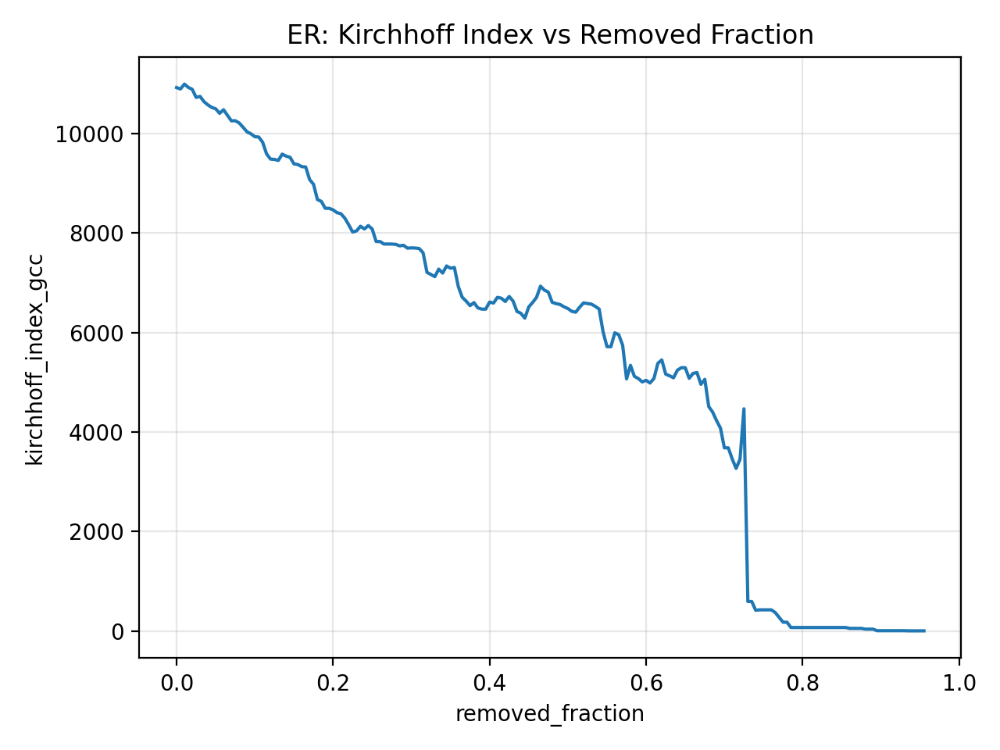


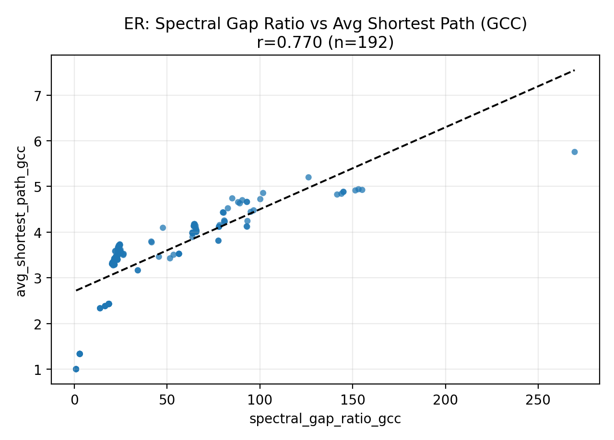

## Experiment Two: Erdos-Renyi Graphs and Degree Attacks

This report summarizes the ER degree-attack results in `results/data/er_degree.csv` and the plots in `results/plots/er_degree`. The dataset contains 201 removal checkpoints for a single Erdos-Renyi graph with 200 nodes (from `gcc_size` at 0 removal). Spectral metrics are computed on the GCC and are missing for 24 checkpoints where the GCC becomes too small.

**Experiment Setup (from `results/data/er_degree.csv`)**
- Graph family: Erdos-Renyi (single instance, `n=200` inferred from `gcc_size` at 0 removal; `p`/seed not recorded in the CSV).
- Failure/attack model: degree-based node removals in increasing fractions `removed_fraction` from 0.0 to 1.0 (201 checkpoints).
- Robustness metrics: `gcc_fraction`, `gcc_size`, `num_components`, `avg_shortest_path_gcc`.
- Spectral metrics on GCC: `algebraic_connectivity_gcc`, `spectral_gap_ratio_gcc`, `kirchhoff_index_gcc`.

**Core Robustness Outcomes**
- The GCC shrinks rapidly under degree attack, dropping below 50% by `removed_fraction=0.425` and below 10% by `removed_fraction=0.575`, as shown in `results/plots/er_degree/er_gcc_fraction.png`.
- Fragmentation increases sharply, with the number of components peaking at 51 around `removed_fraction=0.66` (`results/plots/er_degree/er_num_components.png`).
- The average shortest path within the GCC increases and peaks around `removed_fraction=0.50` (max ≈ 7.47), shown in `results/plots/er_degree/er_avg_shortest_path_gcc.png`.

**Spectral Behavior Across Removals**
- Algebraic connectivity of the GCC drops toward zero as removals progress (min ≈ 0.018 near `removed_fraction=0.56`), reflecting weakened internal connectivity (`results/plots/er_degree/er_algebraic_connectivity_gcc.png`).
- Kirchhoff index grows strongly as the graph fragments and peaks around `removed_fraction=0.425` (max ≈ 18996), mirroring GCC shrinkage (`results/plots/er_degree/er_kirchhoff_index_gcc.png` and `results/plots/er_degree/er_compare_gcc_fraction_vs_kirchhoff.png`).

**Correlation Analysis (Pearson r, n=177 paired points)**
These correlations quantify how well each spectral indicator tracks robustness outcomes in this ER degree-attack dataset.

| Spectral Metric | Robustness Metric | Pearson r |
| --- | --- | --- |
| spectral_gap_ratio_gcc | avg_shortest_path_gcc | 0.879 |
| algebraic_connectivity_gcc | avg_shortest_path_gcc | -0.845 |
| kirchhoff_index_gcc | num_components | -0.809 |
| kirchhoff_index_gcc | avg_shortest_path_gcc | 0.799 |
| kirchhoff_index_gcc | gcc_fraction | 0.758 |
| kirchhoff_index_gcc | gcc_size | 0.758 |
| algebraic_connectivity_gcc | gcc_fraction | -0.442 |
| algebraic_connectivity_gcc | gcc_size | -0.442 |
| algebraic_connectivity_gcc | num_components | 0.378 |
| spectral_gap_ratio_gcc | num_components | -0.125 |
| spectral_gap_ratio_gcc | gcc_fraction | 0.035 |
| spectral_gap_ratio_gcc | gcc_size | 0.035 |

**Key Conclusions Supported by the Data**
- Under degree attacks, path-efficiency inside the GCC is most strongly tracked by spectral gap ratio and algebraic connectivity (very strong correlations with `avg_shortest_path_gcc`).
- Kirchhoff index remains a strong indicator of GCC size and fragmentation (`gcc_fraction`, `gcc_size`, and `num_components`), though path-efficiency metrics dominate the top correlations in this run.
- Spectral gap ratio is a weak predictor of GCC size/fragmentation under targeted degree removals (near-zero correlations with `gcc_fraction`/`gcc_size`).

**Plots Included**
GCC robustness over removals:
- `results/plots/er_degree/er_gcc_fraction.png`
- `results/plots/er_degree/er_num_components.png`
- `results/plots/er_degree/er_avg_shortest_path_gcc.png`

Spectral metrics over removals:
- `results/plots/er_degree/er_algebraic_connectivity_gcc.png`
- `results/plots/er_degree/er_kirchhoff_index_gcc.png`
- `results/plots/er_degree/er_compare_gcc_fraction_vs_kirchhoff.png`

Spectral-vs-robustness relationships:
- `results/plots/er_degree/er_scatter_kirchhoff_vs_gcc_fraction.png`
- `results/plots/er_degree/er_scatter_algebraic_connectivity_vs_avg_shortest_path.png`
- `results/plots/er_degree/er_scatter_spectral_gap_ratio_vs_avg_shortest_path.png`

**Figure Gallery**
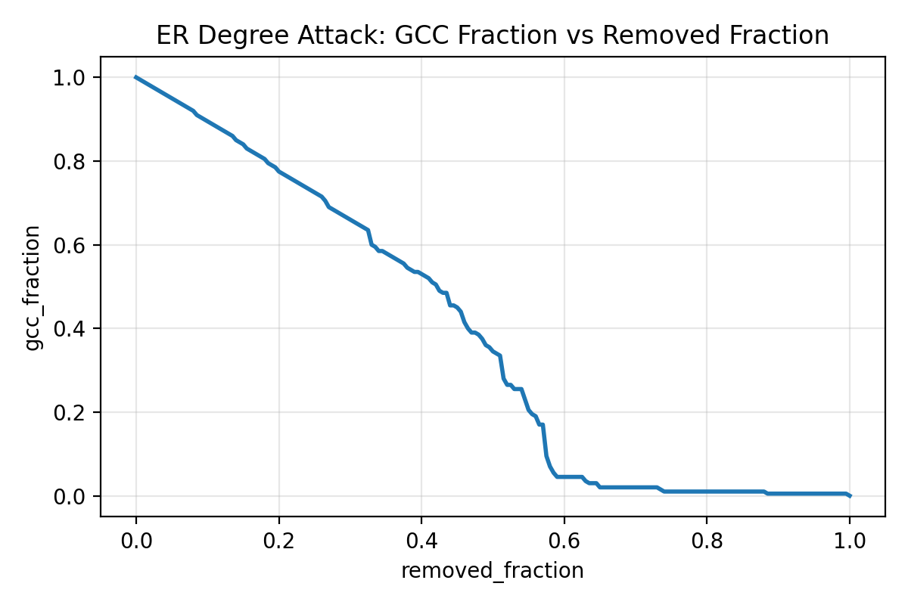
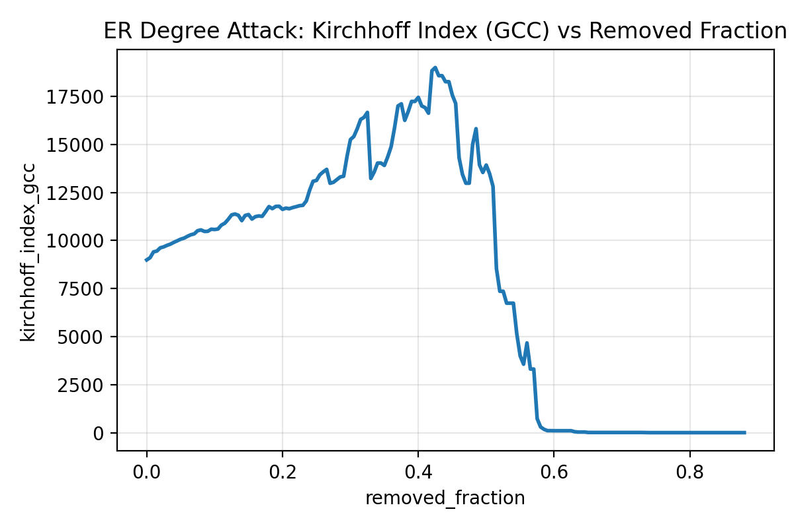
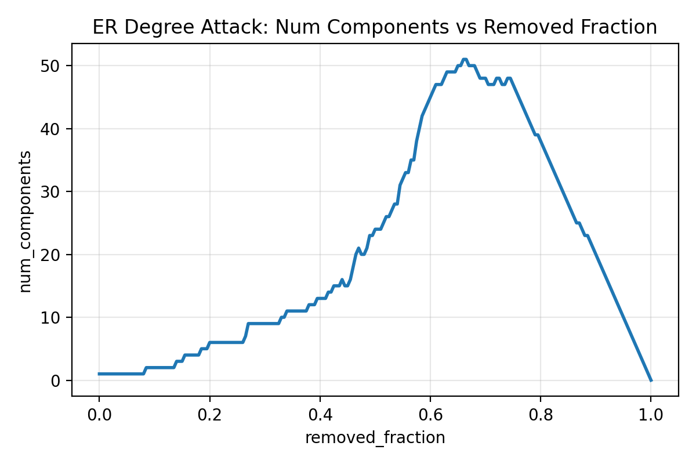
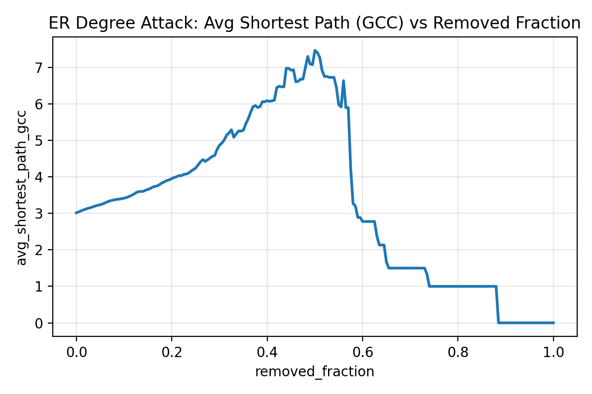
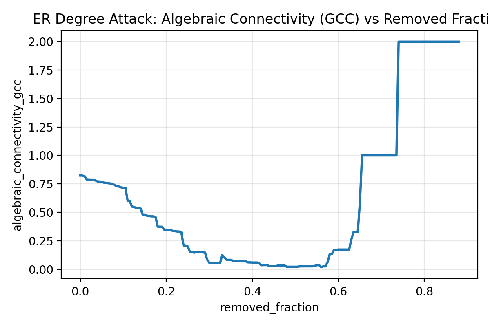

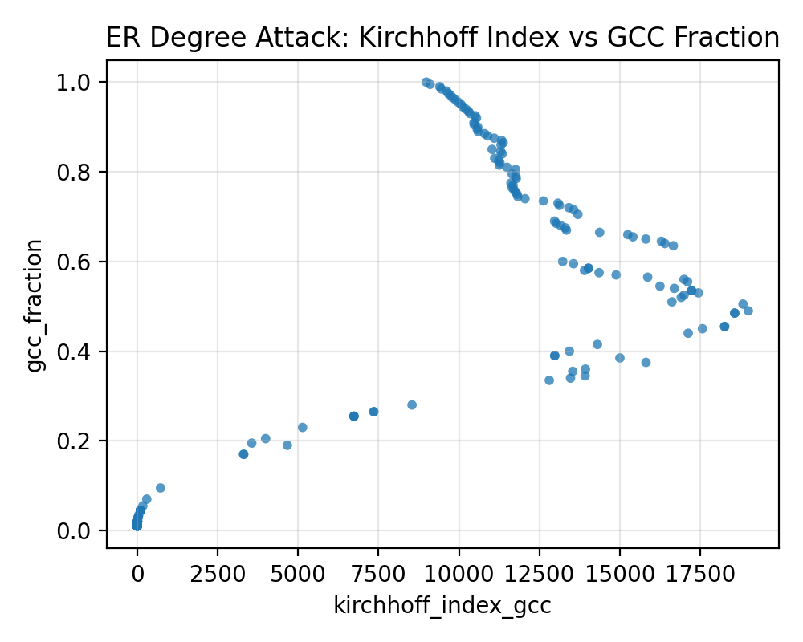
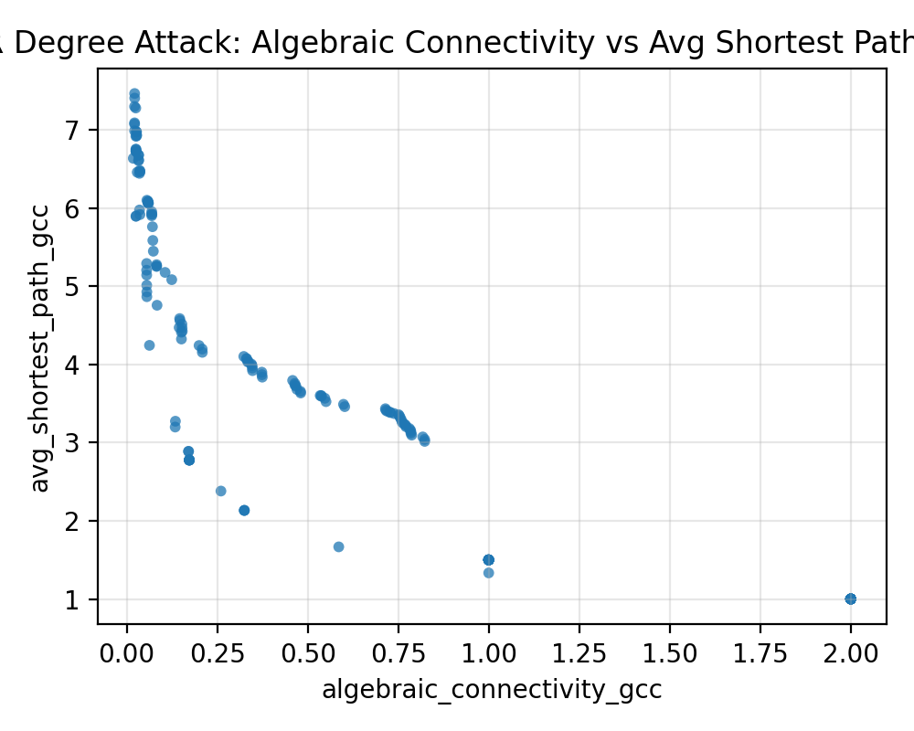
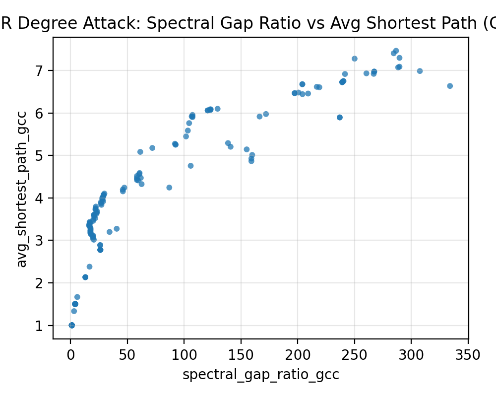

## Side-by-Side Comparison: Random Failures vs Degree Attacks (ER)

This section compares `results/data/er.csv` (random removals) and `results/data/er_degree.csv` (degree attacks) for the same ER graph size (`n=200` inferred from GCC size at zero removal).

**Robustness Milestones**

| Metric | Random Failures | Degree Attacks |
| --- | --- | --- |
| GCC falls below 50% | `removed_fraction=0.48` | `removed_fraction=0.425` |
| GCC falls below 20% | `removed_fraction=0.73` | `removed_fraction=0.555` |
| GCC falls below 10% | `removed_fraction=0.73` | `removed_fraction=0.575` |
| GCC falls below 5% | `removed_fraction=0.785` | `removed_fraction=0.59` |
| Max components (count) | 18 at `removed_fraction=0.79` | 51 at `removed_fraction=0.66` |
| Max avg shortest path (GCC) | 5.756 at `removed_fraction=0.725` | 7.468 at `removed_fraction=0.50` |
| Spectral rows with NaNs | 9 of 201 | 24 of 201 |

**Spectral-to-Robustness Correlations (Pearson r)**

| Pair | Random Failures | Degree Attacks |
| --- | --- | --- |
| kirchhoff_index_gcc vs gcc_fraction | 0.981 | 0.758 |
| kirchhoff_index_gcc vs num_components | -0.964 | -0.809 |
| algebraic_connectivity_gcc vs avg_shortest_path_gcc | -0.712 | -0.845 |
| spectral_gap_ratio_gcc vs avg_shortest_path_gcc | 0.770 | 0.879 |

**Comparison Takeaways**
- Degree attacks collapse the GCC earlier and produce substantially more fragmentation than random failures.
- Path-efficiency inside the GCC degrades more sharply under degree attacks (higher max avg shortest path).
- Kirchhoff index remains a strong proxy for GCC size/fragmentation in both cases, but its correlations are weaker under degree attacks.

**Comparison Plot**
- `results/plots/er_compare_random_vs_degree_gcc_fraction.png`

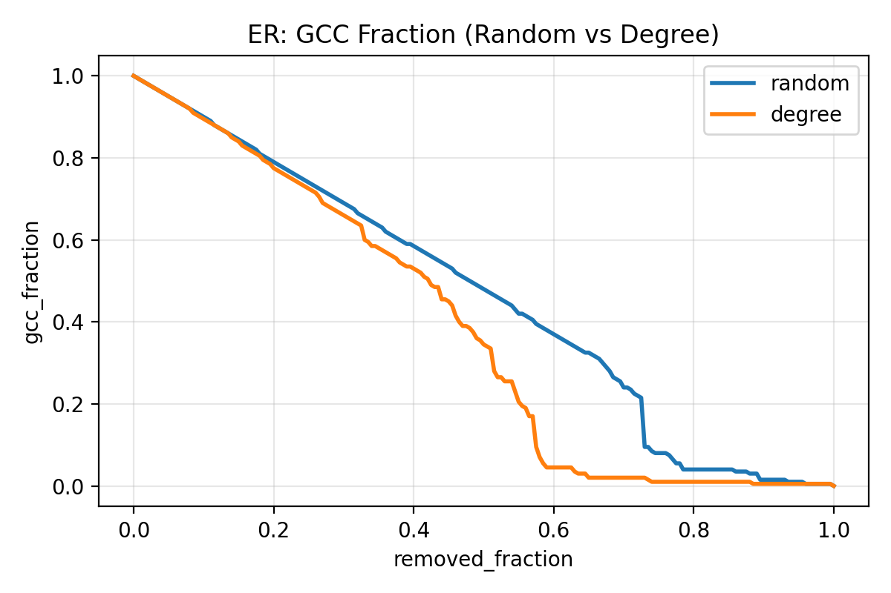
